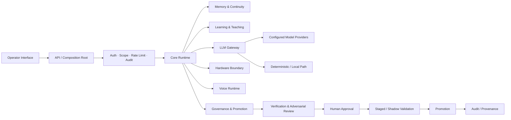

# Architecture

## Purpose

This document describes NOMI at a recruiter-safe systems level. It intentionally avoids private paths, credentials, machine-specific configuration, and exploit-sensitive details.

## Architectural goals

NOMI is designed around five constraints:

1. **Local-first by default** — local processing and local storage are preferred when practical.
2. **Human authority over durable change** — model-generated or learned changes do not silently become system policy.
3. **Fail-closed safety boundaries** — missing or ambiguous authorization should not quietly widen capability.
4. **Provenance and auditability** — system actions, approvals, and candidate changes should be attributable and reviewable.
5. **Separation of truth classes** — observation, memory, prediction, simulation, and generated ideas should not collapse into one undifferentiated state.

## High-level topology



## Private-stack implementation evidence

The private development repository documents an RC7 Phase 2 stack with:

- Python package architecture
- FastAPI API surface
- API-key and scope-based access controls
- rate limiting, request IDs, security headers, and JSONL audit logging
- LLM gateway adapters for OpenAI, Anthropic, Gemini, Replicate, and a deterministic offline provider
- provider timeouts, retries, fallback order, and circuit breakers
- voice-runtime queueing and mock/local synthesis paths
- hardware simulation and privacy-interlock behavior
- authenticated browser dashboard foundations

This public repository does not reproduce the private source.

## Governance plane

Candidate changes are conceptually routed through:

```text
candidate change
  → classification
  → evidence / provenance
  → adversarial review
  → tests
  → human decision
  → staged or shadow validation
  → governed promotion
  → append-only record
```

The key design decision is that **learning evidence can propose change but cannot bypass activation governance**.

## UI as an operational surface

The interface is designed to expose operational state, including:

- execution vs. simulation
- current permissions
- approval status
- provenance
- safety restrictions
- blocked gates
- connection state
- recovery/system health

That is why the GUI is treated as part of the control architecture rather than a cosmetic layer.

## Deployment boundary

The final target is broader than a browser prototype. Historical work includes browser simulations, Tauri-oriented desktop design, local services, and PC/OS architecture research.

Public claims in this repository distinguish:

- what was tested,
- what was implemented but not natively proven,
- what is a prototype,
- and what is planned.

See [docs/IMPLEMENTATION_BOUNDARIES.md](docs/IMPLEMENTATION_BOUNDARIES.md).
