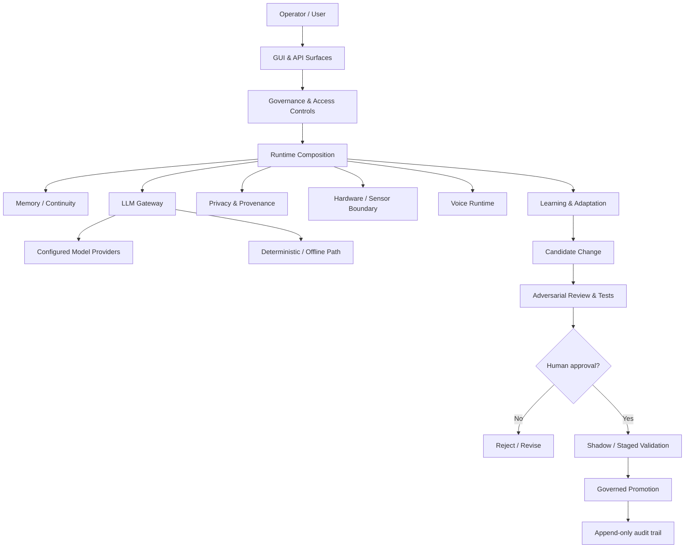

# NOMI — Local-First Cognitive AI Systems Case Study

**Erika Vaughn · Creator & Lead Architect · 2026–Present**  
AI systems engineering · evaluation & verification · privacy/security · AI governance · local-first architecture

[](https://github.com/evaughn00/nomi-ai-systems-case-study/actions/workflows/validate.yml)

> **Sanitized public case study.** NOMI's private source repository remains private. This repository exists to make architecture, engineering decisions, validation evidence, and implementation boundaries reviewable without publishing credentials, private data, machine-specific paths, or security-sensitive implementation details.

> **Publication note:** NOMI development began in 2026. This public repository is a later external-review surface, so its Git history begins when the case study is published; it is not presented as NOMI's full private development history. See [docs/PUBLICATION_NOTE.md](docs/PUBLICATION_NOTE.md).

## 30-second overview

NOMI is a local-first, privacy-focused cognitive AI system built on the NOEMA architecture. I designed it around one constraint: **AI-assisted development should be inspectable, testable, reversible, and subject to explicit human approval before durable promotion.**

My work spans backend/API architecture, adversarial verification, privacy and security controls, governance for system changes, interface architecture, hardware-oriented integration, and validation.

### Engineering evidence

| Area | Evidence |
|---|---|
| Test validation | **276 passing tests** at a governed historical green checkpoint |
| Later repository inventory | **47 Python test modules / 302 identified test functions**; inventory only, not a pass-rate claim |
| Security verification | Adversarial review found a fail-open privacy condition and a sandbox enforcement mismatch; both were corrected and re-verified |
| Interface validation | A **13-route** browser prototype was validated; detailed UI counts are kept in [DESIGN.md](DESIGN.md), not used as headline claims |

The later 302-test inventory was **not executed during that reconciliation**. I therefore do not calculate a 276/302 pass rate or represent all 302 as passing. See [VALIDATION.md](VALIDATION.md).

## What I built

- A **local-first AI systems architecture** with Python services, FastAPI-backed interfaces, explicit access controls, audit/provenance concepts, and offline-capable paths.
- A **multi-model engineering and adversarial verification workflow** in which models can propose, implement, critique, and test, while durable promotion remains a human decision.
- A **governed change process** with change classification, transition records, test gates, shadow/staged validation, rollback/recovery principles, and append-only auditability.
- Privacy and security controls designed around **fail-closed behavior**, scoped access, visible system state, and separation between declared policy and actual enforcement.
- A GUI-first operational design spanning memory, uncertainty, provenance, prediction, governance, system health, and recovery surfaces.
- Hardware- and voice-oriented integration work, including local voice/runtime paths, Raspberry Pi sensing direction, and simulated hardware boundaries.

## Architecture at a glance



The private development stack includes secure API composition, scoped authorization, request/audit handling, model-provider adapters, offline paths, voice-runtime components, and hardware simulation. This repository documents those areas at a recruiter-safe systems level rather than copying private implementation code.

See [ARCHITECTURE.md](ARCHITECTURE.md).

## Verification workflow

I use multiple AI models as **independent engineering viewpoints**, not as an authority layer. Across the project, ChatGPT, Claude, Gemini, and DeepSeek have been used for implementation support, critique, adversarial review, test analysis, and architecture cross-checking.

The rule that matters is provider-independent:

```text
proposal or implementation
  → independent critique / adversarial review
  → tests and evidence
  → human decision
  → staged validation
  → governed promotion or rejection
```

A model can recommend a change. It cannot silently promote one.

## Security findings that changed the system

Two findings materially changed how NOMI treats system-state claims:

1. **Fail-open privacy behavior** — a DNS/WebRTC-related privacy condition could degrade in the wrong direction instead of preserving the intended boundary.
2. **Sandbox enforcement mismatch** — resource restrictions were reported but not actually enforced.

The engineering lesson in both cases was the same: **reported policy is not evidence of enforced policy**. The findings were corrected and re-verified; exploit details and private defensive configuration remain intentionally unpublished.

See [docs/SECURITY_FINDINGS.md](docs/SECURITY_FINDINGS.md) and [SECURITY.md](SECURITY.md).

## Validation policy

Public claims are separated into four categories:

- **Verified implementation** — implementation/test evidence exists in the recorded environment.
- **Implemented but not natively proven** — code exists, but final deployment conditions have not been validated.
- **Prototype / simulation** — intentionally modeled behavior, not represented as a live production system.
- **Planned / research** — architecture or research direction, not an implementation claim.

This distinction is enforced by repository tests and a GitHub Actions workflow. **The CI badge validates this public evidence package; it does not claim that GitHub is executing NOMI's private 276-test suite.**

See [VALIDATION.md](VALIDATION.md), [evidence/public_metrics.json](evidence/public_metrics.json), and [docs/IMPLEMENTATION_BOUNDARIES.md](docs/IMPLEMENTATION_BOUNDARIES.md).

## Selected design work

The GUI is treated as an operational control surface rather than decoration. It is designed to make runtime state, simulation vs. execution, approval state, permissions, provenance, safety restrictions, blocked gates, connection state, and recovery status visible to the operator.

A validated browser prototype covered **13 connected routes** across areas such as Living Workspace, Memory Garden, Discovery, Predictive Discernment, Uncertainty, Provenance, Domain Atlas, System Health, and Settings. Additional prototype counts and their exact scope are documented in [DESIGN.md](DESIGN.md).

## Repository map

```text
.
├── README.md
├── ARCHITECTURE.md
├── CASE_STUDY.md
├── CONTRIBUTING.md
├── DESIGN.md
├── SECURITY.md
├── VALIDATION.md
├── NOTICE.md
├── docs/
│   ├── DECISIONS.md
│   ├── GITHUB_PROFILE_README.md
│   ├── GITHUB_WORKFLOW.md
│   ├── IMPLEMENTATION_BOUNDARIES.md
│   ├── PUBLICATION_NOTE.md
│   ├── RECRUITER_WALKTHROUGH.md
│   └── SECURITY_FINDINGS.md
├── evidence/
│   └── public_metrics.json
├── scripts/
│   └── validate_portfolio.py
├── tests/
│   └── test_public_evidence.py
├── assets/
│   └── screenshots/
│       └── README.md
└── .github/
    ├── pull_request_template.md
    └── workflows/
        └── validate.yml
```

## What is intentionally not public

- NOMI's full private source tree
- credentials, API keys, tokens, or provider secrets
- personal memory/profile data
- machine-specific paths
- private recovery/security material
- detailed exploit steps
- deployment secrets or internal network configuration
- speculative work presented as implemented functionality

## Recruiter path

If you have five minutes:

1. Read this README.
2. Open [CASE_STUDY.md](CASE_STUDY.md).
3. Review [VALIDATION.md](VALIDATION.md).
4. Review [ARCHITECTURE.md](ARCHITECTURE.md).
5. Read [docs/IMPLEMENTATION_BOUNDARIES.md](docs/IMPLEMENTATION_BOUNDARIES.md).

A condensed walkthrough is in [docs/RECRUITER_WALKTHROUGH.md](docs/RECRUITER_WALKTHROUGH.md).

## Current status

NOMI remains an active independent engineering project. The underlying source repository is private. This public repository is intentionally narrow: it demonstrates engineering judgment, architecture, verification discipline, governance, and evidence without turning privacy-sensitive work into a public code dump.

---

**Erika Vaughn**  
AI Systems Engineering · AI Evaluation & Verification · Governance · Local-First AI
